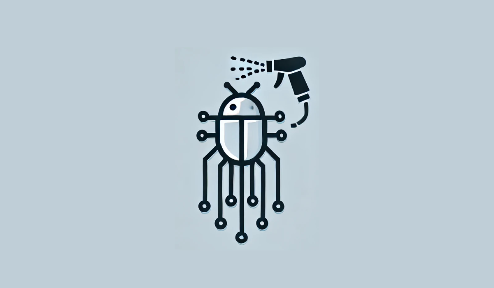

# DebugsprAI - The Bug Spray

<h2 align="center">
🌟 The Ultimate AI-Powered Debugging Assistant 🌟
</h2>



Welcome to **debugsprAI**, where AI meets automation to revolutionize debugging! 🐞🔫

In today's fast-paced development world, AI isn't just assisting—it's solving real problems. From writing code to detecting vulnerabilities, AI is reshaping the way developers work. **DebugsprAI** takes it a step further by automatically fixing bugs directly from GitHub issues, making debugging effortless and efficient.

Imagine this: A developer opens an issue describing a bug. Instead of waiting for manual intervention, **DebugsprAI** jumps in, scans the source code, applies a fix, and submits a pull request—*automatically*.  
No delays, no bottlenecks, just seamless AI-powered debugging.

> Even better when AI is integrated into the review process in the automated manner.

## Table of Content <!-- omit header-->

- [Table of Content ](#table-of-content-)
- [Proof of Concept](#proof-of-concept)
  - [Technology Stacks](#technology-stacks)
- [Installation - ⚠️ UNDER CONSTRUCTION](#installation---️-under-construction)
  - [Prerequisites](#prerequisites)
  - [Setup](#setup)
- [How to Use -- ⚠️ UNDER CONSTRUCTION](#how-to-use----️-under-construction)
  - [Enable GitHub Actions Workflow](#enable-github-actions-workflow)
  - [Create a Bug Ticket](#create-a-bug-ticket)
  - [Watch debugsprAI in Action](#watch-debugsprai-in-action)
  - [Review \& Merge](#review--merge)
- [🎯 Why Choose _DebugsprAI_?](#-why-choose-debugsprai)
- [🚀 Future Enhancements](#-future-enhancements)
- [🤝🏻 Contributing](#-contributing)
- [💡 Have feedback or ideas? Create an issue or reach out!](#-have-feedback-or-ideas-create-an-issue-or-reach-out)
- [🪪 License](#-license)

## Proof of Concept

DebugsprAI is a proof of concept project that demonstrates AI-powered bug fixing. It is built with Python and integrates Google's Gemini LLM, leveraging GitHub Actions to automate the debugging workflow.

The system listens for newly created GitHub issues, analyzes the reported problem, identifies the affected code, and applies intelligent fixes. Here's how it works:

1. **Issue Detection** – When a developer reports a bug on GitHub, DebugsprAI captures the issue.
2. **AI-Powered Analysis** – The AI (Gemini) interprets the issue description, locates the relevant code, and suggests potential fixes.
3. **Automated Code Modification** – Using AI-driven debugging, it adjusts the source code accordingly.
4. **Pull Request Generation** – The fixed code is committed, and a pull request is automatically created for review.
This project explores the potential of AI in software debugging, automating tedious processes to enhance development efficiency. 🔥

### Technology Stacks


## Installation - ⚠️ UNDER CONSTRUCTION

To get started with **debugsprAI**, follow these steps:

### Prerequisites

- Python 3.8+
- GitHub repository with Issues enabled
- OpenAI API key (or any LLM-compatible service)
- GitHub Actions enabled

### Setup

```bash
# Clone the repository
git clone https://github.com/yourusername/debugsprAI.git
cd debugsprAI

# Install dependencies
pip install -r requirements.txt

# Set up API keys (if required)
export OPENAI_API_KEY=your_api_key_here
```

## How to Use -- ⚠️ UNDER CONSTRUCTION

### Enable GitHub Actions Workflow

Ensure you have a GitHub Actions workflow set up to trigger on new issues. Add the following workflow file under `.github/workflows/debugsprai.yml`:

```yaml
name: DebugsprAI Bug Fixing

on:
  issues:
    types: [opened]

jobs:
  fix_bug:
    runs-on: ubuntu-latest
    steps:
      - name: Checkout repository
        uses: actions/checkout@v3
      
      - name: Set up Python
        uses: actions/setup-python@v3
        with:
          python-version: '3.8'
      
      - name: Install dependencies
        run: |
          pip install -r requirements.txt
      
      - name: Run debugsprAI
        env:
          OPENAI_API_KEY: ${{ secrets.OPENAI_API_KEY }}
        run: |
          python run_debugsprAI.py
```

### Create a Bug Ticket

Open an issue on GitHub describing a bug in your project. **Example:**

> "Fix the off-by-one error in `calculate_discount.py` that causes incorrect pricing calculations."

### Watch debugsprAI in Action

Once an issue is created, **DebugsprAI** will: 
✅ Analyze the issue text  
✅ Locate the relevant source code  
✅ Apply a fix  
✅ Generate a pull request with the suggested changes

### Review & Merge

Once the PR is created, a developer can review, approve, and merge the fix effortlessly! 🚀
Or even better, you let the AI review the pull request!!!

## 🎯 Why Choose _DebugsprAI_?

✅ **Saves developer time** - No more manual debugging bottlenecks.\
✅ **Seamless GitHub integration** - Works directly with your existing workflows.\
✅ **AI-powered accuracy** - Smart debugging with minimal false positives.\
✅ **Automated PRs** - Fixes are delivered in a developer-friendly way.

## 🚀 Future Enhancements

We're continuously improving **DebugsprAI** to:

- Support multiple programming languages
- Enhance bug-fixing accuracy with fine-tuned models
- Introduce custom AI training for project-specific debugging

## 🤝🏻 Contributing

Join the revolution in AI-driven debugging! Fork the project, contribute, and help shape the future of **DebugsprAI**.

💡 Have feedback or ideas? Create an issue or reach out!
---

🔗 [GitHub Repository](https://github.com/afri-bit/DebugsprAI) | 🚀 Happy Debugging! 🐞


## 🪪 License

MIT